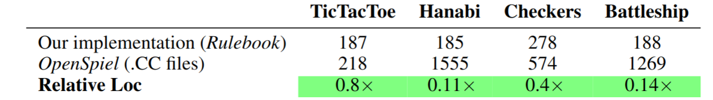

# RLC


### RL and RLC
> **Rulebook is the programming language to write rules in the age of machine learning.**


From a single simple description, generate all tools you may need. Test your rules with fuzzers, generate machine learning agents, use it in C or python, embed it in graphical engines and on the web. All automatically.

Rulebook contains unique mechanisms that cannot be implemented in mainstream languages such as c, cpp and python that mathematically guarantees asymptotically less code to write the same rules. (paper to be released soon.)

The following table compares the number of lines of code required to implement a given game in Rulebook and CPP, excluding their header files. The number of lines they require scales quadratically with respect to the complexity of the game. Our does not.


Furthermore, we have performances comparable to CPP implementations.


Read the project rationale [here](./docs/where_we_are_going.md)

Read the language rationale [here](./docs/rationale.md)

Read a tutorial explaining how to play black jack [here](./docs/tutorial.md)

Read how we analyzed a off the shelf game [here](./docs/space_hulk_level_design.md)

Language reference and stdlib documentation [here](https://github.com/rl-language/rlc-stdlib-doc/tree/master)


### Example: tic tac toe
```

# declares the equivalent of a struct called Board.
# It contains the tic tac toe slots and the current player turn
# Methods omitted for brevity
cls Board:
	Int[9] slots
	Bool playerTurn

@classes
act play() -> TicTacToe:
	# allocates and initializes a board of type Board
	let board : Board
	while !full(board):

		# declares a suspension point of the simulation,
		# an action called mark that requires two ints to be performed.
		act mark(Int x, Int y) {
		# declares contraints about which inputs are valid
			x < 3,
			x >= 0,
			y < 3,
			y >= 0,
			board.get(x, y) == 0
		}

		# marks the board at the position provided
		board.set(x, y)

		# if the current player has three marks in a line
		# return
		if board.three_in_a_line():
			return

		board.change_current_player()


fun main() -> Int:
	# creates a new game
	let game = play()
	game.mark(0, 0)
	# X _ _
	# _ _ _
	# _ _ _
	game.mark(1, 0)
	# X O _
	# _ _ _
	# _ _ _
	game.mark(1, 1)
	# X O _
	# _ X _
	# _ _ _
	game.mark(2, 0)
	# X O O
	# _ X _
	# _ _ _
	game.mark(2, 2)
	# X O O
	# _ X _
	# _ _ X

	# returns 1 because player 1 indeed
	# had three marks in a line
	return int(game.board.three_in_a_line())
```

### Installation

Create a file to test it is working, and fill it with the following content.
```
# file.rl

@classes
act play() -> Game:
    frm score = 0.0
    act win(Bool do_it)
    if do_it:
        score = 1.0
```

Install rlc and test it with:
```
pip install rl_language
rlc-learn file.rl --steps-per-env 100 -o net # ctrl+c to interrupt after a while
rlc-probs file.rl net
```
It will to learn pass true to `win` to maximize `score`, as reported by the second command.
```
---------- 0 : p0 ------------
{resume_index: 1, score: 0.000000}
--------- probs --------------
0: win {do_it: true}  98.9385 %
1: win {do_it: false}  1.0615 %
------------------------------
{resume_index: -1, score: 1.000000}
```

Read a tutorial explaining how to play black jack [here](./docs/tutorial.md)


### Dependencies
Base:
* cpp17 compiler
* python
* CMake

Extra dependecies used by the setup script:
* Bash
* Ninja
* virtualenv
* lld

### License

We wish for `RLC` to be usable by all as a compiler, for both commercial and non-commercial purposes, so it is released under apache license.


### Installation for compiler developers developers
Stop reading if you don't want to work on the compiler.

We provide a setup script that downloads the rlc repository and a setup script that will download and compile `LLVM` as well as `RLC`. As long as the dependencies written before are met you should just be able to run the following commands and everything should work. Installing and building llvm debug will take ~100 gigabytes of hard drive space and will require a large amount of time and RAM. This is only required when building from sources, pypi packages are much less than 1gb on each operating system.

Hard drive space can be reclaimed by deleting `LLVM` build directory after it has been fully built.

Download the setup.sh file in the root of the repository and then run:
```
chmod +x setup.sh
source ./setup.sh # clones RLC repo and initialize virtualenvs and submodules
python rlc/build.py # clones LLVM, builds it and builds RLC
```

on mac and windows replace the last line with
```
python rlc/build.py --no-use-lld
```

If that script terminates successfully, you are fully set up to start working on `RLC`.

#### What do if run out of space or memory
Instead of the previous command python, you can run. This will only build the release LLVM version and save a great deal of space.
```
python rlc/build.py --no-debug-llvm
```

#### Using a custom LLVM
```
python rlc/build.py --llvm-dir <PATH-TO-LLVM-INSTALL> [--rlc-shared]
```

You need to use the flag --rlc-shared if you have built a shared LLVM.

### environment.sh
If you are using the default installation script (setup.sh) we provide a .sh file that configures your environment variable so that you can use python and rlc without installing anything in your actual machine.
When you open a shell to start working on RLC run the following command.

If you use some editor such as code or clion, start it from that shell.

```
source environment.sh
```

To check if everything works correctly run the following command.
```
python python/solve.py ./tool/rlc/test/tic_tac_toe.rl
```
If it does not crashes, then you are good to go.

If you use some whacky shell of your own or you did not followed the default setup, you are on your own.

### Contacts

[Discord](https://discord.gg/saSEj9PAt3)
[Twitter](https://twitter.com/RulebookL3873)
[Youtube](https://www.youtube.com/watch?v=tMnBo3TGIbU)


### How to contribute for developers
* fork this project.
* push your branches to your fork
* open a pull request for the branch relevant to your project

The intent of this workflow is so that reviewrs can use the review feature of github pull requests to have persistent comment threads.

### Roadmap for 1.0

#### language
* better debug support
* inline inline initializers
* better ranged based loops
* better cast guards

#### standard lib
* dictionary library


