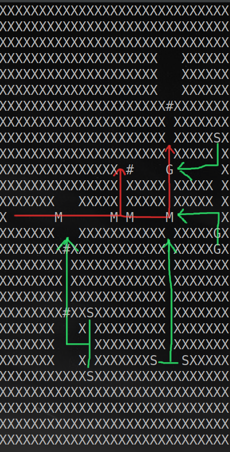
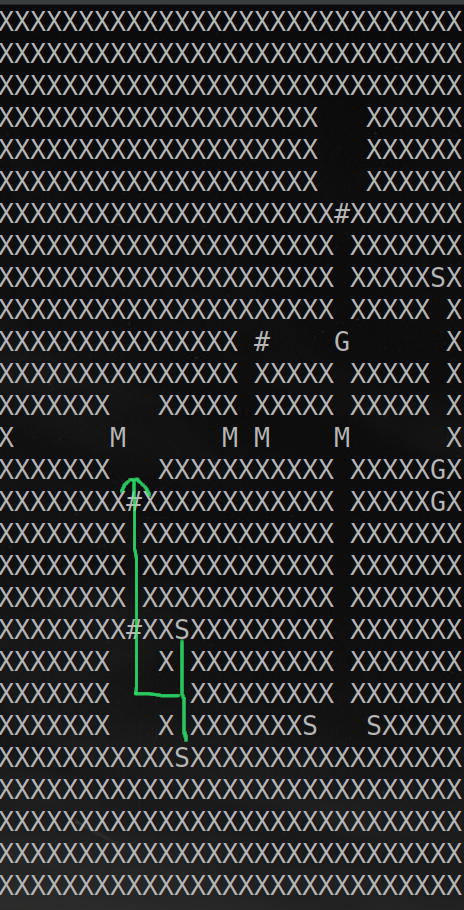

# Bringing machine learning to everyday board game design

[](https://asciinema.org/a/YDiq4xj15wMu5bgjegkuMAfaq)

Game design has historically been constrained by designers' ability to deeply understand their own games, primarily due to the cost of playtesting.

A game that is simple enough to not require playtesting is often too simple to be of particular interest to end users. Conversely, games complex enough to engage end users can be so intricate that their creators might misunderstand some or all possible interactions within the game, resulting in a product that differs from what was intended.

Playtesting allows designers to observe their games in action and understand how they truly behave, correcting any misconceptions about the mechanics.

Unfortunately, playtesting is a time-consuming and delicate process. Large groups of people must be recruited to gather comprehensive results. Moreover, even if playtesting focuses on a specific game component (e.g., understanding what new players find overwhelming in a particular area), unrelated components might invalidate a playtesting cycle (for instance, if a trivial strategy is too strong, most playtesters might interact only with that part of the game, ignoring the area of interest). Ideally, designers would like to replace as much of the playtesting process as possible with other techniques during development, but unfortunately, not many alternative techniques exist.

Machine learning offers opportunities in this domain. If a machine can learn to play the game, the designer can observe which strategies yield which results. Rule changes that introduce trivial errors, which would have wasted a playtesting iteration, can be detected without playing a single game. Strategies that appear more appealing than they are strong will be identified, allowing the designer to decide whether to keep the game components that generate these strategies for players to learn from or to replace them with better ones.

While many games have already been solved using machine learning techniques, few have been designed with the aid of machine learning. Unfortunately, machine learning involves many complexities, and although hardware costs decrease each year, the expense of hiring machine learning engineers to create and maintain machine learning-compatible game implementations remains high.

This document shows that with the use of the **RL** language, any designer with some programming knowledge and a mid-range gaming computer can now employ machine learning techniques and gain better insights into their games.

**If you are not interested in the methods used to achieve these results and only care about the outcomes, you can jump to the "Setting up an experiment" section and continue from there.**

### What this document is:
As mentioned in the introduction, this document aims to demonstrate how game design can be enhanced using existing machine learning techniques and how game designers with little coding experience can gain insights into their designs by using the RL language.

* We provide a brief high-level description of what machine learning is.
* We describe Space Hulk, a real-world board game of average complexity with many features that make it challenging to tackle with machine learning techniques.
* We show how Space Hulk was implemented in the RL language, requiring minimal knowledge of how machine learning works.
* We describe what we have learned by observing a machine learning agent that has learned to play the game.

This document is aimed at game designers and does not require in-depth knowledge about machine learning, although some understanding of programming is required.

### What this document is not:

The aim of this document is not to describe how to produce a machine learning model that can play Space Hulk at a superhuman level. Currently, creating a superhuman agent through machine learning involves tinkering with the core components of machine learning, such as selecting the best algorithm for the situation, tuning learning parameters, and providing enough computational resources. These are complex tasks that may be too challenging for the average game designer.

Instead, we aim to show that with a very limited computational budget and minimal understanding of machine learning and computers, it is still possible to derive significant value from applying machine learning to game design. We do not suggest that the entire game design process can be replaced by machine learning techniques but rather that some time-consuming and expensive aspects can be made quicker and cheaper using machine learning.

Additionally, our implementation of Space Hulk is not perfect. We have omitted every scenario except for Scenario 2, special weapons, and some advanced rules. These omissions were made because they were not relevant to what we were trying to prove and would have required more time to implement without providing significant benefits to us or the reader.

If you are interested in the rationale behind this project, you may refer to the project rationale [here](./where_we_are_going.md). If you are interested in the programming mechanisms behind the project, you may refer to the language rationale [here](./rationale.md).

## Machine learning

Using the Wikipedia definition of machine learning, we say that "machine learning is [...] concerned with the development and study of statistical algorithms that can learn from data and generalize to unseen data, and thus perform tasks without explicit instructions."

What does this mean? It means, for example, that machine learning is the field of study that develops algorithms (which we will call actors) from data (game states of some game played by such actors) and generalizes to unseen data (game states never seen by the actor). Thus, the algorithm can play decently without explicit instructions.

In other words, machine learning helps us create a digital actor that can play the game, and the more it plays, the better it becomes at playing the game.


### How have we configured machine learning?

Setting up a machine learning algorithm is not a trivial process. Before a computer can effectively learn from playing a game, many parameters must be adjusted and tuned to achieve effective results. Additionally, there is a significant difference between a machine learning setup that learns something and one that learns a lot. Information about the game being learned can inform which machine learning configurations are best to use. For example, a game like chess, with just two players, no hidden information, and no randomness, is well-suited to reasoning deeply about future states by examining each possible move one at a time. In contrast, a car racing game is more about short-term control of the vehicle rather than long-term planning. Currently, these two situations are better solved by different machine learning techniques.

Since we cannot know which particular game the designer is trying to test, we cannot provide the best machine learning configurations for their specific problem. Instead, we must provide a general-purpose algorithm that works well in many situations. The same holds for all other configurations. Later in this document, we will examine the properties of the game Space Hulk that make it challenging to handle, requiring us to use a very generic setup that can be reused for other games as well.

A fundamental requirement for machine learning is that the game must provide feedback about good and poor choices, even when playing random moves. For example, if a machine learning system plays chess at random, it can gain insights by observing which games end in a win or a draw. Conversely, if we need to teach a machine learning system to walk on a rope without falling, we cannot reward the system only for walking a kilometer, as it will never achieve this by playing at random. Instead, we should reward the system for even taking a single step on the rope without falling. We will later see how this critical information affects the training process.
## Space Hulk

[Space Hulk Third Edition](https://boardgamegeek.com/boardgame/54625/space-hulk-third-edition) is a real-world, two-player, asymmetric, imperfect information, zero-sum, non-deterministic board game. In Space Hulk, one player controls the Marine faction, consisting of a 5-10 man squad. This squad navigates a maze-like spaceship while attempting to achieve an objective, such as destroying a particular object or reaching a specific point. The opposing player attempts to prevent them from doing so by controlling the aliens inhabiting the spaceship, ideally by killing the Marines.

Let us look at the map of Scenario 2:
* *X* are impassable walls.
* *#* are doors that block lines of sight and passage. Doors can be toggled to be opened and closed. (annotated in green in the image)
* *M* are Marines, who all start on the left side of the map. (annotated in red in the image)
* *S* are spawn points where enemy aliens will appear. (annotated in blue in the image)
* *G* are aliens, who are not present on the map at the start of the game.


In Scenario 2, the Marines are trying to reach the top right room of the map, while the aliens are trying to kill them before they can do so. During the course of the game, the board may evolve into a situation like this (the map is annotated with routes that may be taken by the two factions):



Marines are strongest at the beginning of the game, with no ability to reinforce their numbers, while the opponent starts with zero aliens on the board but spawns some each turn. Thus, the game is built around the tension between risking Marine lives and progressing towards the objective, knowing that if the game goes too late, the opponent will surely win.

Given this high-level description, the game may seem very trivial, with not many interesting choices to be made. However, the game has a surprisingly large number of choices. Let us examine the state machine of the game to see if this is the case.


The above graph represents all the actions that can be executed in the game and how they are related to each other.

* The game begins at the ellipse labeled "play" on the right side of the image and continues by visiting the nodes of the image until the node "ret" is encountered.

* White boxes represent "single actions," which are atomic actions that affect the game somehow but have no other significant impact. For example, *toggle\_door* and *turn* are single actions. The first can be used when a character is in front of a door, and that door is opened or closed depending on its previous state. The second action is used to rotate a character in place.

* An arrow between two actions means that after the first action has been executed, the second action must be executed as well. For example, after you execute the single action *shoot*, the player must execute the action *roll_dice*. *Shoot* identifies the marine who is shooting and the alien being targeted, while *roll_dice* rolls the dice and determines a consequence based on the result. If an action has more than one outgoing arrow, only one of the actions pointed to by the outgoing arrows can be executed after the first one, depending on the state of the game.

* White rhombuses represent nodes with multiple choices. When you reach a rhombus, any of the actions pointed to by arrows from the rhombus can be taken. For example, when you begin to move a unit, you can choose to turn it, move it, or do nothing at all.

* Colored boxes are "composed actions." When such a box is to be executed, all the actions in the ellipses with the same color are executed instead, until an ellipse labeled "ret" is encountered. Then the game continues with the action following the original colored box. For example, the game begins at "play," which is followed by the green *initial_blips* composed action. This requires the alien player to place a certain number of aliens one at a time. When the alien player finishes placing them, the "ret" node in the *place_blip* section is encountered, and thus the next action is the composed action *marine_phase*.

By looking at this graph, the scope and intricacies of the game become clearer. This is a game about shooting, assaulting, turning, opening doors, guarding, and overwatching. It is a positional game where the decision to not guard a particular door may lead to victory or defeat.

Considering that each action may refer to each character (for example, when you move a character, you need to specify which one), the game ends up with approximately 1,500 distinct actions.

### Characteristics of Space Hulk

Now that we have seen the high-level description of Space Hulk, let us dig deeper into the characteristics of Space Hulk and how they affect machine learning. This is a significant part of this document because if you are a designer and the game you are developing has similar characteristics to those described here, it can be tested through machine learning in the same way.

* **Average complexity**: Space Hulk is not the most complex board game ever designed, but it is not the simplest either. Board Game Geek assigns Space Hulk a complexity rating of 2.75 out of 5, corresponding to a light-medium to medium complexity rating. Roughly half of the games are more complex and half are less.

* **Two-player game**: Space Hulk is a two-player game. As one might guess, two-player games are significantly more difficult to test than single-player games and easier than games with three or more players. The most significant difference between two-player games and games with more players is the presence of politics. The solution we used to test Space Hulk has no mechanism to allow players to coordinate, while real-world players may verbally articulate pacts. If your game heavily relies on politics between players, then the machine learning techniques presented here are poor solutions. Games with significant politics include [Diplomacy](https://boardgamegeek.com/boardgame/483/diplomacy), where it is difficult for one player to accumulate enough power to win without convincing other players to provide help.

* **Asymmetric game**: The two players in Space Hulk perform different activities. One player controls a limited number of powerful characters that can shoot at a distance and surveil corridors. The other player controls faster, weaker characters that keep respawning and try to swarm the enemy. This is a difficult setup for machine learning since one player may have significantly easier game patterns to learn than the other, and one player may learn so much faster that the other is always dominated, leading to failure in every attempt. If your game is not deeply asymmetrical, or not asymmetrical at all, it will be significantly easier to learn.

* **Infinite horizon**: Most modern board games are designed so that even if every player plays at random, the game will still end after a while, due to turn limits, victory point limits, and so on. Such games are called finite horizon games. Space Hulk does not have this property. This means that when the machine learning system has not yet learned much and is playing almost at random, the game may never end. We solve this issue by placing a maximum number of turns to be played, which terminates the game in a draw if reached. This decision introduces some issues. The machine learning system may learn to abuse the max turn limit and try to slow down the game when it thinks it cannot win, forcing a draw rather than a loss. This makes it harder to obtain good insights about the end parts of the game. An average game of Space Hulk ends up being 1000-2000 actions long, which is a fairly long time horizon for a single game. Most games require fewer actions to be played, and shorter games are easier to learn.

* **Non-deterministic**: Space Hulk involves luck, with dice rolls determining the winner of melee actions and whether a target is destroyed. Most games have some kind of luck involved, whether it be dice, decks of cards, and so on. Non-determinism is not the most significant factor that determines whether a game is easy or hard to handle by machine learning, but it is pervasive in board games and acknowledged here.

* **Secret information**: Space Hulk contains game information known only to one player until revealed by the rules. This is one of the most significant aspects when implementing the machine learning components. If all information in a game is known to all players, as in chess, it is possible to design a solution based on enumerating all possible future states given the current game state and then deciding what to do. If some information is unknown, it is impossible to enumerate all future states. Space Hulk falls into this category, and our machine learning solution does not assume it can enumerate future states. However, we stopped short of implementing game secret information in the rules, because they were not relevant to what we were trying to test and would have required much more time to implement for little benefit given our objective of writing this document.

* **Playing at random means drawing the game**: The previously mentioned characteristics combine to make this probably the most significant characteristic of Space Hulk, which greatly affects machine learning training. The game is so long and the victory condition so far from the starting location of the players that players playing at random will never win or lose. Marines need to traverse long corridors, open doors, and turn. Aliens need to get from their spawning points to the opponents' positions, which may change and kill them before they complete their objective. If we just encode the victory condition into the game and let them find it by playing at random, they will never win. To obtain any result, we must provide some help in the form of a heuristic function, a simple function that, given a game state, returns a score suggesting how good that state is. Of course, this score cannot be exact, as knowing how good it is would render machine learning unnecessary. Instead, this heuristic function is very simple. We say that states where marines are closer to their objective are better for them, states where marines are dead and states where aliens are close to the marine objective are good for the aliens, and states where one of the players has won are very good for that player and very bad for the other. This is the only extra information we provide to the machine learning system to help it train the network.

* **The game is zero-sum, but not really**: A zero-sum game is one where a player gains value only by taking it from other players. For most board games, value is being the winner. The only way for a player to win is by making their opponents lose. Zero-sum games are significantly easier to learn because there is no point in coordinating with opponents; the only reason to communicate is to trick them into losing. If the game is not zero-sum, for example because multiple winners are allowed, then coordination may be the way to achieve better results, making the game significantly more complex. According to its rulebook, Space Hulk is a zero-sum game: either the marines or the aliens win. However, because of the previously mentioned points, it is not. Since we have introduced a heuristic to help the players figure out how to play, the machine learning components are no longer trying to maximize the real objective of winning the game, but rather the objective of winning when they can, maximizing the heuristic, and drawing the game when they cannot win. This may lead to situations where the two players learn to collaborate when neither can win, making it harder to analyze results obtained by machine learning, though it does not greatly affect the early game when both are setting themselves up to win.

* **The game has infinite size**: Some games, like chess, have a very precise size. Chess starts with a given number of pieces and they never increase throughout the game. Some games have infinite size, often due to rules allowing unlimited components. Finite size games are easier to handle in machine learning because it means we have a very precise understanding of how to describe such games to the machine learning components. Infinite size games are harder to handle, requiring arbitrary constraints about the maximal size of game pieces. In our situation, we set an arbitrary maximum number of ~25 aliens on the map.

* **No sprawling amount of rules**: Some games have huge amounts of rules but hide them on game components such as decks of cards. Space Hulk is not such a game; the amount of rules is fairly limited and does not include decks of cards. We chose not to select a game with sprawling rules simply because implementing such games would have taken longer. Games with many rules are harder to learn.

To recap, Space Hulk is a game of average complexity that has difficult properties to learn regarding every property of the game except having no politics and not having a sprawling amount of rules. If your game or a section of your game has the same or better properties, it can be tested in the same way we will now describe.

## RL implementation

[This](../tool/rlc/test/examples/space_hulk/) folder contains the implementation of Space Hulk used for the training. The most significant file is the [main.rl](../tool/rlc/test/examples/space_hulk/main.rl) file. Ignoring test functions, the whole implementation of space hulk ammounts to ~1000 lines of code.
Of course since space hulk is a real game and not just a proof of concept, the files are not trivial to read.

There are two points we want to put under the spotlight:
* At line 159 of main.rl you can find the implementation of toggle\_door.

```python
      act toggle_door(UnitArgType unit_id) {
        board.unit_id_is_valid(unit_id.value),
        board.units.get(unit_id.value).action_points != 0,
        board.is_facing_door(board.units.get(unit_id.value))
      }
       ref unit = board.units.get(unit_id.value)
       unit.action_points = unit.action_points - 1
       board.toggle_door(unit) # just changes the value of a integer in the map
```

The action toggle door takes as argument the id of the unit that is trying to toggle the door. It has three lines of code within brackets that specify when the action can be executed, that is when the argument unit\_id is valid, when the unit referred by the id has action points left, and when when the unit is facing a door. Then the code specifies that the effect of toggling a door is to reduce the action points of the unit, and switching the integer value of the considered door.

This piece of code is the entire implementation of toggling a door in the game. By writing this piece of code the machine learning components are automatically aware that this is something they can do. You do not need to specify anything else.

If you remove that block of code, the possibility of removing a door will disapear from existance and the machine learning will no longer be allowed to toggle them.

Look now at the shoot action:

```python
      act shoot(frm UnitArgType unit_id, frm UnitArgType target_id) {
        board.unit_id_is_valid(unit_id.value),
        board.unit_id_is_valid(target_id.value),
        board.can_shoot(board.units.get(unit_id.value), board.units.get(target_id.value), false, false),
        board.units.get(unit_id.value).faction() == current_faction,
        !(board.units.get(target_id.value).faction() == current_faction)
      }
        act roll_dice(DiceRoll roll1)
        frm roll = roll1
        act roll_dice(DiceRoll roll2)
        if board.shoot_at(board.units.get(unit_id.value), board.units.get(target_id.value), false, false, roll, roll2):
          board.gsc_killed = board.gsc_killed + 1
          board.units.erase(target_id.value)
```

The shoot action specifies that it needs two argument, the ID of the source and the ID of the target (ignore the frm keyword for now). It specifies that the two IDs must be valid, that the source can shoot at the target and that the faction of the two units cannot be the same. Then the line `act roll_dice(DiceRoll roll1)` is generating a dice roll and so `act roll_dice(DiceRoll roll2)` does the same. Then the function `board.shoot_at` calculates if the two dice rolled are a fatal hit according to the rules. If they are, the target unit is removed.


* Notice as well that while the game contains some obscure keywords that are specific to this language, the files contain no code that is specific to machine learning. Every line of code is expressing game concepts, and is doing so in a imperative manner. If you can understand the previous two illustrated functions, you can edit them and you can replicate the results presented in this document.

If you want a more in depth tutorial to create a RL file for your game, you can read more here [Tutorial comming soon!].
If you are interested in the theoretical side of how we achieve our results, you can read more [here](./rationale.md), and you can see easier examples which have both entry points at the function called play() [here](../tool/rlc/test/tic_tac_toe.rl ) and [here](../tool/rlc/test/pebble_game.rl)


## Learning space hulk

### Used Hardware

This document aims to show that even with fairly modest resources, it is still possible to obtain significant insights into the analyzed game.

For our training runs, we limited ourselves to a single machine with the following specifications:

* 32 GB of memory
* 12 GB of video memory
* 8 i7 cores
* Less than 100 GB of long-term storage
* Less than a week of training
* PPO algorithm configured to perform decently on various heterogeneous tasks

At the time of writing, gaming machines with comparable specs are available on the market for approximately 1500 euros.

The setup we used for the training was not particularly optimized. For example, a bug in the third-party machine learning library, which we have not managed to solve at the time of writing this document, caused us to use twice as much video RAM as needed. Similarly, as indicated in the previous sections, our setup was intended to be generic and not specialized for Space Hulk in particular.

### Provided Information

The machine learning mechanism receives the following information:
* The rules of the game (initial state, actions, end states, and scores)
* A mapping between a game state and the player that needs to take an action
* The heuristic described earlier that helps the learning

That is it.

### Setting Up an Experiment

In the previous sections, we described Space Hulk and how certain properties of the game affect the learning stage. We noted that because the game needs a heuristic to learn properly, learning the game from the start rather than focusing on interesting subsets (such as specific endgame situations) might make endgame strategies unreliable.

Therefore, we have two alternatives:
* Create some endgame setups and study how the endgame plays out
* Let the machine learning model learn from the start of the game and study the high-level strategies instead of the low-level tactics

Since Space Hulk has been in existence for several years and is not known to be trivially broken, there is no point in showing that the low-level tactics are not broken. Therefore, we will focus on the high-level tactics.

Let us consider once again the map of the implemented scenario and focus on the bottom left corridor.



Notice that the corridor is a source of enemies, but there is no point for the Marines to walk down that route. The Marines only want to reach the top right room. Assuming the game is not broken in more trivial ways, the core question we are trying to answer is:

* **Is there ever any reason for the alien player to spawn enemies in the bottom left spawn point, or would it always be better to place them all in better locations near the enemy objective?**

This is not trivial to answer without playing the game multiple times. Maybe the rules imply that attacking the Marines from the back once they have moved deeper into the map is optimal, or maybe it is best to just throw everyone in front of the Marines and swarm them with numbers. Perhaps the two decisions are fairly equivalent.

We can already see that something is going on with that corridor. The designer placed not one, but two doors—one for the aliens to open and one for the Marine to open to get a better line of sight. We can only speculate why they did it, but we can at least assume that zone was of particular interest to them.

Now that we have described the properties of the game, the machine learning setup, and the question we want to answer, we just need to train the network. If the machine learns to use that part of the map properly, we can say with some confidence that the corridor has some right to exist. If the machine dominates the game by spawning every alien there, we can say that such a strategy is too strong. If the corridor is never used, we can observe how the machine has learned to play and try to understand why it thinks it is a poor choice.

### Results

Here are the results obtained after approximately five days of training. Note that the training could have continued longer; it was interrupted once we obtained data interesting enough to create this document.

First, a result illustrating the late-game poor performance arising from the Marine player having learned to abuse the turn limit instead of risking it all to be lucky and win the game. Around action 750, we can already see that two Marines stay behind in a safe place instead of moving forward.

[](https://asciinema.org/a/mr9KEhMobJyLLsYi0XML3qsNP)

Here is the luckiest Marine game we observed. The aliens commit on turn one to racing down the middle corridor and get entirely gunned down the whole game due to good rolls.

[](https://asciinema.org/a/tch5HantuEBG74uFEx1RgyP2Q)

Now let us look at a more balanced game. In this game, we observe that the alien player has learned to move its characters in a block so that those in front protect those in the back from being shot at. The Marine player finds itself in a poor situation and decides not to take risks anymore and goes for the draw instead, leading to an unsatisfying conclusion.

[](https://asciinema.org/a/2MxkpH76tJukgwVvMWeDrJFg2)

### Analysis

**In the whole training process, we have never observed the alien player rely on the bottom left corridor as a core part of its strategy.** At the skill level obtained after approximately four days of training, the machine learning process managed to find strategies involving all spawn points and locations except for those in the bottom left. As a further test, when we forced the alien player to place its first spawned alien in the bottom left spawn point and let the network train with that forced move, we observed no impact on the win rate of the trained agents.

Looking back at the games we just saw, this makes sense. The five Marines block each other's way, and it is very difficult for the Marines to win the game when the first three are dead. Even if the Marine player leaves one of its guys back, this has no particular impact on the results. Similarly, if the alien player is very lucky and manages to kill the last Marine in the row by using the bottom left zone, the game is still entirely decided by what happens to the first three Marines.

While this is not proof that the lower left section of the map is useless, it is a significant indication that the designer should think deeply about that section of the map. Of course, this behavior we discovered may be entirely intended.

### Conclusion

In this document, we showed how machine learning can be used to create an agent that learns to play a game and how games of average complexity can be implemented with very little knowledge beyond basic programming. Finally, we showed how the trained agents can be used to obtain insights that would have been fairly difficult to obtain through human-driven playtests.

If you are interested in knowing more, about custom solutions, or how you can train AI for your own games, you can contact us at the links provided on the homepage [here](../), or you can send an email to massimo.fioravanti@polimi.it.

