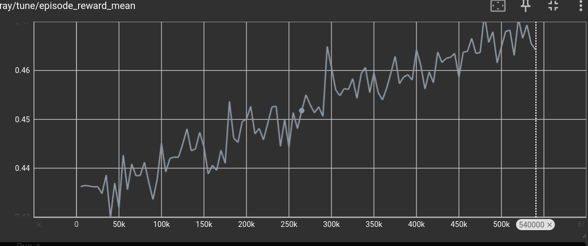
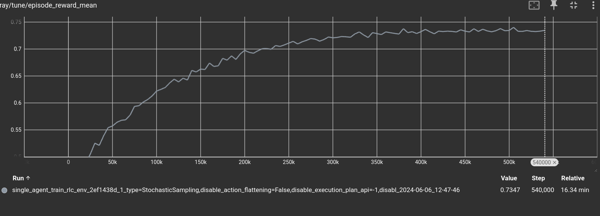

# Tutorial for RL people

The `Rulebook` language is designed, among other things, to help you use reinforcement learning techniques. It does so by helping you write simulated environments in which machine learning agents can learn, without requiring the user to write any code related to machine learning, beside specificing minimal and maximal bounds of variables.

The `RL` language does not provide new reinforcement learning methods; instead, it concerns itself with the issue of writing simulations only. You can use any learning algorithm you wish when using an `RL` language simulation.

Of course, included in the `RL` language package are off-the-shelf machine learning algorithms for those who do not have the skill required to write a custom solution. We will see how a user with no machine learning knowledge can still use `RL` and obtain solutions for their own optimization problems.

## Requirements

To run the following examples, you need:
* At least Python 3.8 installed with `pip`.

Optionally, you can install:

* Visual Studio Code, for which we provide syntax highlighting and autocomplete plugins. They are called `rl-lsp` and `rl-language`.

## Installation
You can install the `RL` compiler, autocomplete support, and machine learning dependencies by opening a terminal and running:
```bash
mkdir rl_example
cd rl_example
python3 -m venv .venv
source .venv/bin/activate
pip install rl_language
```

This command creates a virtual environment separate from your computer environment so that you can try `rlc` without polluting your machine.

If this command completes successfully, you can validate that the installation has been successful with:
```bash
rlc --help
```

Now we can write a very simple hello world program to see how it works. Create a file called `example.rl` in the current directory, and fill it with the following content:

```python
import serialization.print

fun main() -> Int:
    print("hello world")
    return 0
```

As you can see, the language has a Python-like syntax, although you can already notice that in `RL` types are not optional; they must always be present. We can now compile the program and see it run:

```bash
rlc example.rl -o executable
./executable
```

## Training and Running

Now that you've ensured your system works, download the `black jack` example from [here](https://github.com/rl-language/rlc/tool/rlc/test/examples/black_jack.rl) and save it in a file in the directory we created at the start of this example.

Black jack is example that shows how to handle games with randomness and imperfect information. Indeed the actions taken by the real user are usually just one or two, while most of the game is spent by the `randomness player` shuffling the deck, which is a fake player that performs actions at random.


After you have copied it, let us make sure we can run generate a random game.

```
rlc-random black_jack.rl
```

You will see that it prints the actions to be executed in a game, this include the shuffling of the deck.
You can visualize what is happeing with

```
rlc-random black_jack.rl -o game.log
rlc-action black_jack.rl game.log -pp
```

You will be able to visualize the evolution of the deck while it is being suffled, and then see which action the player will take.


Now that we have visualized a random game, we can start learning! Tou can run `rlc-learn` to do so:
```bash
rlc-learn black_jack.rl |& tee log.txt
```

If you have not installed torch and cuda, this invocation will fail. If it does fail, you can open the file `log.txt` and try to see what you are missing to run it.


If it does work, then from your browser, you can now visit the website:
```
127.0.0.1:6006
```

From there, you should see a website that looks like this:


In the search bar, write `episode_reward_mean`.

You should see a graph that looks similar to the following:



The x-axis is the number of actions played. In the case of our game, it means the number of `hits` and `stand` executed, the y-axis is instead the average score obtained. As exepected the average score is increasing, that is: it is learning to play.

Of course, the machine will never achieve a average score of one, because there is no guarantee you can always hit 21 points, not even if you knew the order of the cards in the deck. Furthermore, the size of the neural network has been defaulted to a reasonable size, but there is no guarantee that the problem is solvable given the default size.

Still, with very few commands and a very simple `.rl` file, we managed to have a reasonably configured network up and learning.

Let it train for as long as you wish. We stopped the training after ~500.000 moves, at around 0.75 mean return. That is, the network learned when it should keep drawing more cards and when not to.



After you have interrupted the training, you can generate a game by running:
```bash
rlc-play black_jack.rl network -o game.log
```

The command will create a file called `game.log` that contains a human-readable game that you can inspect, or you can reproduce it by running:
```bash
rlc-action black_jack.rl game.log -pp
```

This command will run one action at a time and let you visualize the game by invoking `pretty_print` after each action is executed. You need to press any button to advance the game by one action.

## Building on Top of It

Until now, we have seen how to write, train, run, and visualize a game. Of course, this is not the end of the road. After you have trained a network, you probably wish to use the rules you have written in a real environment. Let us see how to do so by writing a Python script that can interact with the `RL` black jack implementation.

Create a file called `example.py`, and write the following content:
```python
from rlc import compile
import random

# load the rl file
program = compile(["black_jack.rl"])
# starts a rlc program invoking the user defined play
# function and wraps it in object for with some usefull methods
state = program.start()

# invokes directly the user defined function on the real state object
while program.module.get_current_player(state.state) == -1:
    # enumerate legal actions using the methods defined on the
    # wrapper
    action = random.choice(state.legal_actions)
    state.step(action)

# prints the state
state.pretty_print()

# checks for termination by using the helper functions
while not state.is_done():
    print("hit? (y/n)")
    decision = input()
    # invokes user defined actions directly
    if decision == "y":
        state.state.hit()
    else:
        state.state.stand()

    state.pretty_print()

print(f"Your final score is: {program.score(state.state, 0)}")
```

You can run this program with the following command, using a shell with the activated environment:
```bash
python example.py
```

As you can see, you are able to play black jack driven by a Python script. Of course, you could already do so with the `rlc-action` command provided by the `rl_language` package, but this example shows that `RL` programs can be easily used from other languages such as Python or C++. This allows you to reuse the same `RL` code you have written to train the network in production too, building other tools on top of it!

You can also load the network you have trained and use it to play games, but such a setup is a little too complex to include in this introductory document and will be shown later.

## Performance

If you wish, you can take a look at the classes that are generated by `rlc` by running
```
rlc black_jack.rl --header -o header.h
```

For example, if you search for `typedef union Shuffle` in the file you will see what gets preserved between actions when the game performs the shuffling.
```c
struct _Content {
    int64_t resume_index;
    int64_t to_shuffle;
    BIntT0T52T a;
  } content;
```

It contains 2 `int64_t` and a `BIntT0T52T` which if you check, is a `int64_t` itself. That is it, it takes 3 integers to `rlc` to keep track of what must be shuffled. If you stop the game while it still shuffling and save the content to disk, 3 only integers will be saved to keep track of it (on top of what must be preserved because of other parts of the game, of course).

This allow you to write very efficient games, and to have them interoperate with C and python.


## Conclusions

At the start of this document, we described how machine learning works and what `RL` aims to achieve. In particular, we covered:

* **How you can write games and optimization problems in `RL`.**

  As you saw, `RL` lets you write games and simulations the way you conceptualize them by declaring at each point which actions the user must take in that moment.

* **How you can run, with zero configurations required, a neural network to find good strategies for your problem.**

  As you observed, it takes a single command to have the machine learning components up and learning. While the default setup may not yield optimal results, it provides a starting point for those who can tune the machine learning configurations to their needs and is easy to use for those who cannot.

* **How `RL` can interoperate with other languages, such as C, C++, and Python, and how easy it is to integrate into other codebases.**

  We demonstrated how other programs can interact with the simulation by importing an `RL` file and invoking functions and actions declared in that file, without needing to relinquish the main loop of the program to the `RL` part. In our example, we showed how to do this in Python, but it could be done with any other programming language or environment, such as graphic engines.

* **What code, performance-wise, you can expect to be generated from `RL`.**

  `RL` is a compiled language, not an interpreted language, yielding performance comparable to other compiled languages such as C.
