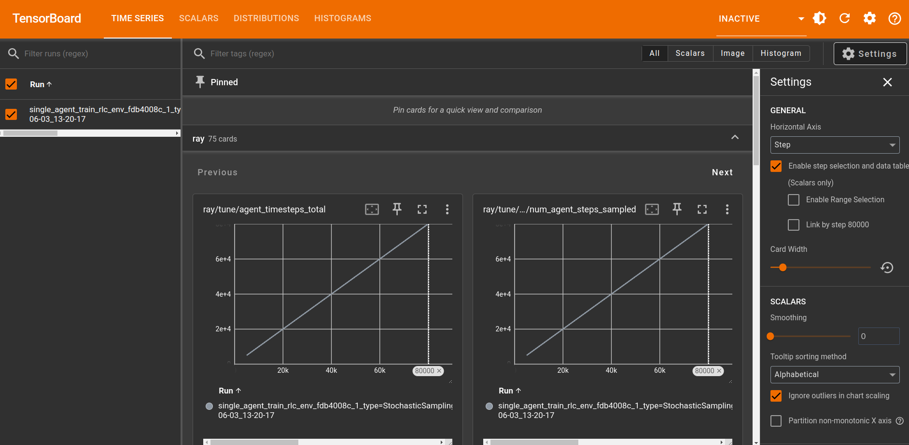
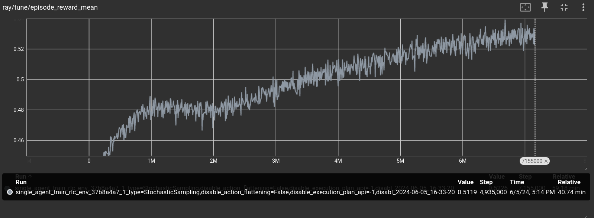

# Rulebook Introduction

RL is a reinforcement learning-centric scripting language aimed at delivering reinforcement learning techniques to users with no experience in machine learning, while also allowing full control to users who know how to tune and modify machine learning components.

## Recap on Reinforcement Learning
Reinforcement learning is the field of science that studies algorithms that learn to make decisions to achieve the most optimal result. Examples of reinforcement learning include:

* Computer systems that learn to play chess by only knowing the rules of chess.
* Car driving systems that learn to drive without crashing in a real or simulated environment.

The reinforcement learning life cycle is divided into two steps: learning and deployment. In the learning step, the reinforcement learning system interacts with a real or simulated environment to learn to perform better at whatever task it was designed for. For example, a chess system may learn to play chess by playing against itself. When deployed, the system stops learning and instead performs the task it was intended for in a real environment. For example, a chess system may play against humans.


When training reinforcement learning solutions, there are sets of metrics that must ideally be maximized (or minimized):

* **Performance**: We want the learning system to become as proficient as possible at whatever task it was meant to learn. In theory, the final quality of learning of a given problem only depends on the learning algorithm and its configurations, which are bounded by humanity's knowledge of theoretical machine learning. In practice, it also depends on the quality of the hardware, since faster hardware can allow the use of techniques that perform worse on small training runs but better on longer training runs.
* **Learning speed**: We want the system to learn as fast as possible. Learning speed is a property of both the speed of the hardware and the known learning algorithms.
* **Costs**: Regardless of what we want to produce, we wish to do so as cheaply as possible.

These three metrics are interconnected. Decreasing the cost of hardware may allow us to afford more hardware, which may yield better learning speeds and performance results. Increasing performance by two times may require ten times the costs.

## Rulebook and Reinforcement Learning

As we mentioned, the `Rulebook` language is designed to help you use reinforcement learning techniques. It does so by helping you write simulated environments in which machine learning agents can learn. Let's consider the previously mentioned machine learning metrics and see how `Rulebook` addresses them:

* **Learning speed**:
    * **Simulation speed**: To learn, a machine learning algorithm must interact with a real or simulated environment to try actions and see what happens. The faster the simulated environment executes, the faster the learner can learn. We will show how writing `RL` programs helps you create efficient simulated environments.
    * **Development speed**: A simulated environment in which an algorithm can learn is software like any other. Writing, maintaining, and deploying it is a time-consuming process, and the fidelity of the simulation to reality is critical to obtaining high-quality results. We will show how using `RL` helps you create simulated environments faster and more easily than using alternative languages.
* **Costs**:
    * **Development costs**: As mentioned in the context of learning speed, maintaining a simulation of the environment in which learning occurs is a significant development cost. Simplifying that aspect of development with the `RL` language helps reduce the costs of debugging, updating, and generally modifying the simulation.
    * **Human costs**: A team developing reinforcement learning solutions is costly to maintain, requiring a wide range of skills, including machine learning, development, and domain-specific knowledge. By simplifying the creation of digital environments in which agents can learn, we allow smaller teams to create their products without needing multiple human resources with different skill sets.
    * **Deployment costs**: Some `RL` agents are meant to operate in the real world, such as autonomous driving systems, and thus after deployment, the simulation in which they were trained is no longer relevant. Others can operate in the same environment they were trained in; for example, a chess learning algorithm can learn and be deployed in the same simulation of chess. In such cases, the simulated environment is not just a training utility but also something to be deployed to the end-user. This may include adding extra features to the simulation, such as a way to render the simulation state on screen, a way for humans to interact with the simulation, and so on. We will see how the `RL` language helps you develop, maintain, and deploy simulations beyond just learning.
    * **Interoperability costs**: Sometimes it is necessary for machine learning systems to interact with other pre-existing components. For example, parts of the simulation from which the machine learning system is learning may be third-party programs beyond the programmer's ability to modify. We will see how `RL` can interoperate with tools and libraries written in other languages.

Notice that we have not talked about final learned performance. That is intentional. The `RL` language does not provide new reinforcement learning methods; instead, it concerns itself with the issue of writing simulations only. You can use any learning algorithm you wish when using an `RL` language simulation.

Of course, included in the `RL` language package are off-the-shelf machine learning algorithms for those who do not have the skill required to write a custom solution. We will see how a user with no machine learning knowledge can still use `RL` and obtain solutions for their own optimization problems.

For more non-technical information, you can check out:

* The project rationale [here](./where_we_are_going.md)
* The language rationale [here](./rationale.md)
* How we analyzed an off-the-shelf game [here](./space_hulk_level_design.md)

## About this Document

As specified in the previous sections, this document aims to provide an overview of the `RL` language, offering a hands-on approach where the reader can try the language on their own machine. By the end of this document, you will learn:

* How to write games and optimization problems in `RL`.
* How to run a neural network with zero configurations required to find good strategies for your problem.
* How `RL` can interoperate with other languages, such as C, C++, and Python, and how easy it is to integrate into other codebases.
* What code, performance-wise, you can expect to be generated from `RL`.

## Warnings

This document is intended to be a proof of concept. The language has not yet been released under version 1.0, and our intent is to collect feedback about the language.

**This document requires some understanding of programming. If you can program in Python or a similar language, you should be able to follow the content presented here.**

As of the moment of writing (1/6/2024), games with multiple players do not work off the shelf due to issues in the library providing the built-in machine learning agent. If you are interested in solving multi-agent scenarios, contact us and we will guide you on how to solve the issues. We plan to address this issue as soon as possible.

## Requirements

To run the following examples, you need:

* A Linux x64 machine (we plan to support every major architecture and OS in the future, but currently, we are limited by the systems supported by the libraries we depend upon).
* At least Python 3.8 installed with `pip`.
* Clang, which can be installed with `sudo apt install clang` or `sudo yum install clang`.

Optionally, you can install:

* Visual Studio Code, for which we provide syntax highlighting and autocomplete plugins. They are called `rl-lsp` and `rl-language`.

## Installation

You can install the `RL` compiler, autocomplete support, and machine learning dependencies by opening a terminal and running:
```bash
mkdir rl_example
cd rl_example
python3 -m venv .venv
source .venv/bin/activate
pip install rl_language
```

This command creates a virtual environment separate from your computer environment so that you can try `rlc` without polluting your machine.

If this command completes successfully, you can validate that the installation has been successful with:
```bash
rlc --help
```

Now we can write a very simple hello world program to see how it works. Create a file called `example.rl` in the current directory, and fill it with the following content:

```python
import serialization.print

fun main() -> Int:
    print("hello world")
    return 0
```

As you can see, the language has a Python-like syntax, although you can already notice that in `RL` types are not optional; they must always be present. We can now compile the program and see it run:

```bash
rlc example.rl -o executable
./executable
```

## Training and Running

Now that you've ensured your system works, download the `black jack` example from [here](../tool/rlc/test/examples/black_jack.rl) and save it in a file in the directory we created at the start of this example.

Read the example and make sure you understand it. If you are interested in learning more about the mechanisms described there, you can also read the files described [here](../tool/rlc/test/tutorial/2.rl) and [here](../tool/rlc/test/tutorial/3.rl). And you can try out the sudoku example [here](../tool/rlc/test/examples/sudoku.rl).

After you have copied it, you can run `rlc-learn` and see it learn:
```bash
rlc-learn black_jack.rl |& tee log.txt
```

If you have not installed torch and cuda, this invocation will fail. If it does fail, you can open the file `log.txt` and try to see what you are missing to run it.

If it does learn, you can open the log and scroll down until you see a line that looks like the following:
```bash
tensorboard --logdir /tmp/ray/session_DATE/artifacts/DATE/tuner_run_DATE/driver_artifacts
```

Open another terminal and navigate to the example directory you have created, and source the environment again:
```bash
cd rl_example
source ./venv/bin/activate
```

Then run the line you found in the `log.txt` file. From your browser, you can now visit the website:
```
127.0.0.1:6006
```

From there, you should see a website that looks like this:



In the search bar, write `episode_reward_mean`.

You should see a graph that looks similar to the following:


The x-axis is the number of actions played. In the case of our game, it means the number of cells that have been filled across multiple games by the learning agent. The y-axis represents the average score obtained by the learner. As you can see, the more games it plays, the better scores it gets—it is actually learning how to play!

Of course, there is no guarantee that the machine will achieve a score of one, since we are generating random boards, and not all random boards are solvable. Furthermore, the size of the neural network has been defaulted to a reasonable size, but there is no guarantee that the problem is solvable given the default size.

Still, with very few commands and a very simple `.rl` file, we managed to have a reasonably configured network up and learning.

Let it train for as long as you wish. We stopped the training after ~500.000 moves, at around 0.75 mean return. That is, the network learned when it should keep drawing more cards and when not to.



After you have interrupted the training, you can generate a game by running:
```bash
rlc-play black_jack.rl network -o game.log
```

The command will create a file called `game.log` that contains a human-readable game that you can inspect, or you can reproduce it by running:
```bash
rlc-action black_jack.rl game.log -pp
```

This command will run one action at a time and let you visualize the game by invoking `pretty_print` after each action is executed. You need to press any button to advance the game by one action.

## Building on Top of It

Until now, we have seen how to write, train, run, and visualize a game. Of course, this is not the end of the road. After you have trained a network, you probably wish to use the rules you have written in a real environment. Let us see how to do so by writing a Python script that can interact with the `RL` black jack implementation.

Create a file called `example.py`, and write the following content:
```python
from loader import compile
import random

# load the rl file
rl_module = compile("black_jack.rl")
state = rl_module.functions.play()

while rl_module.functions.get_current_player(state) == -1:
    action = random.choice(rl_module.valid_actions(state))
    rl_module.functions.apply(action, state)

rl_module.functions.pretty_print(state)
while state.resume_index != -1:
    print("hit? (y/n)")
    decision = input()
    if decision == "y":
        rl_module.functions.hit(state)
    else:
        rl_module.functions.stand(state)

    rl_module.functions.pretty_print(state)
```

You can run this program with the following command, using a shell with the activated environment:
```bash
python example.py
```

As you can see, you are able to play black jack driven by a Python script. Of course, you could already do so with the `rlc-action` command provided by the `rl_language` package, but this example shows that `RL` programs can be easily used from other languages such as Python or C++. This allows you to reuse the same `RL` code you have written to train the network in production too, building other tools on top of it!

You can also load the network you have trained and use it to play games, but such a setup is a little too complex to include in this introductory document and will be shown later.

## Conclusions

At the start of this document, we described how machine learning works and what `RL` aims to achieve. In particular, we covered:

* **How you can write games and optimization problems in `RL`.**

  As you saw, `RL` lets you write games and simulations the way you conceptualize them by declaring at each point which actions the user must take in that moment.

* **How you can run, with zero configurations required, a neural network to find good strategies for your problem.**

  As you observed, it takes a single command to have the machine learning components up and learning. While the default setup may not yield optimal results, it provides a starting point for those who can tune the machine learning configurations to their needs and is easy to use for those who cannot.

* **How `RL` can interoperate with other languages, such as C, C++, and Python, and how easy it is to integrate into other codebases.**

  We demonstrated how other programs can interact with the simulation by importing an `RL` file and invoking functions and actions declared in that file, without needing to relinquish the main loop of the program to the `RL` part. In our example, we showed how to do this in Python, but it could be done with any other programming language or environment, such as graphic engines.

* **What code, performance-wise, you can expect to be generated from `RL`.**

  `RL` is a compiled language, not an interpreted language, yielding performance comparable to other compiled languages such as C.
